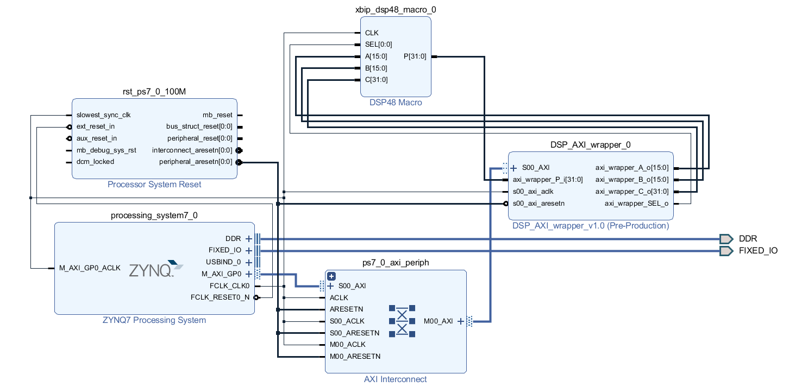

Final Project
====================

# Demo time

2020/1/6 17:30

# 題目

1. Audio Equalizer ( Using DSP Module )

## dsp module的block_design

## 實作方法

1. 使用LAB06所教導之PYTHON on PYNQ方法來溝通軟體與I/O
2. 學習音源wav檔之處理方式並對其做變化
3. 使用dsp module做一些運算
